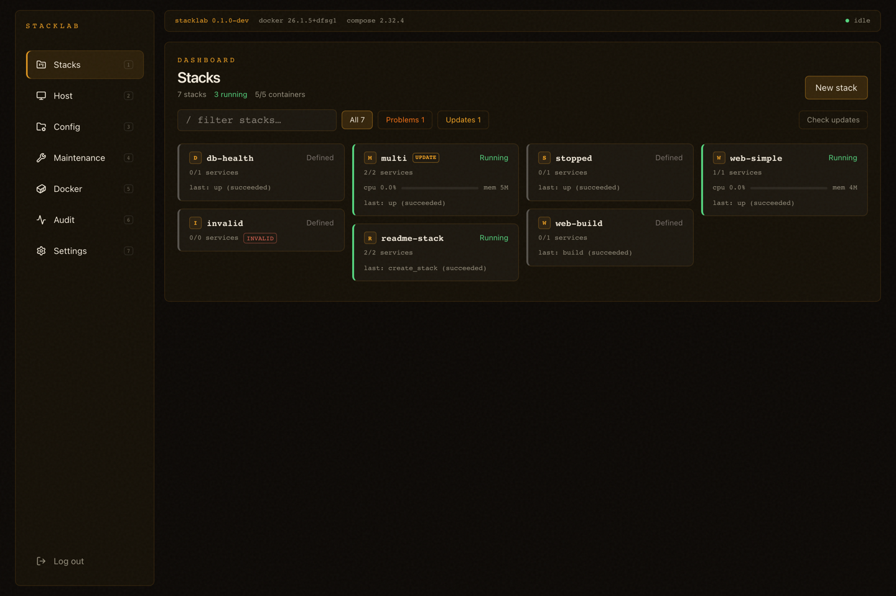
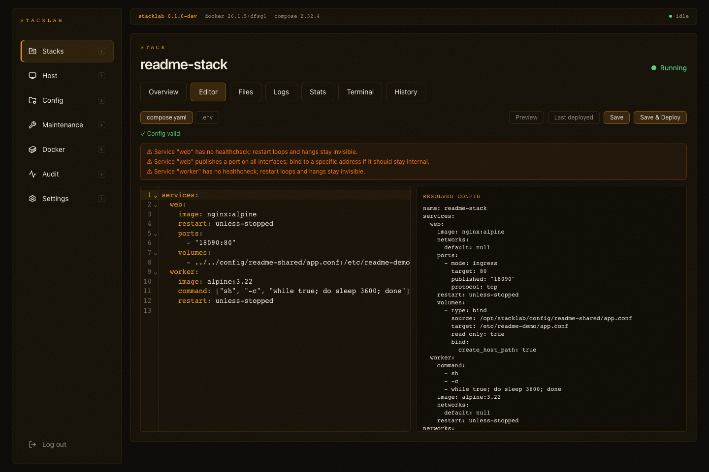
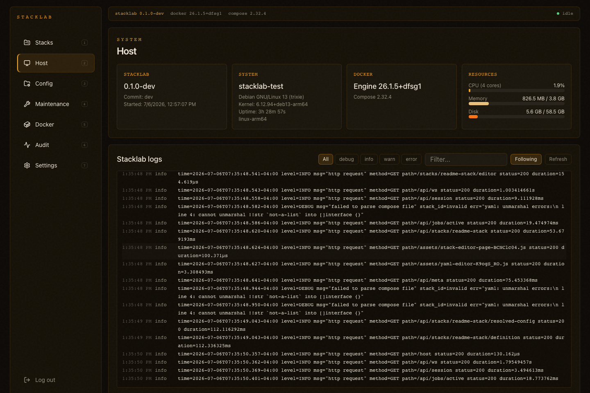
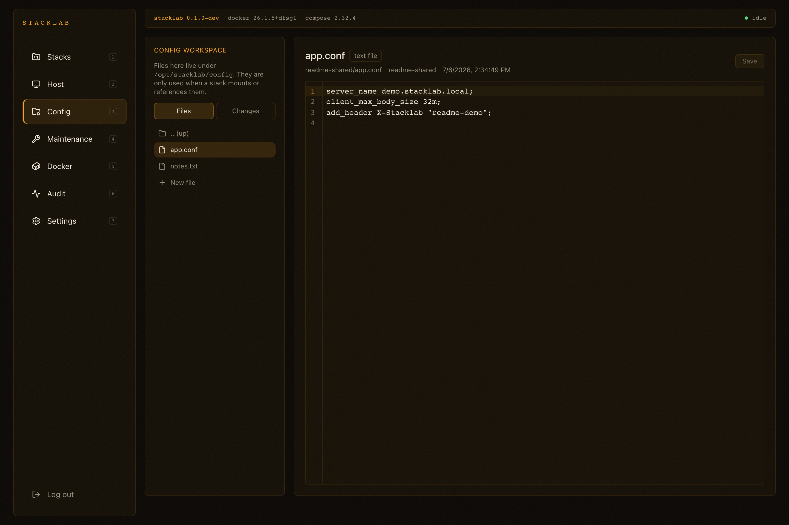
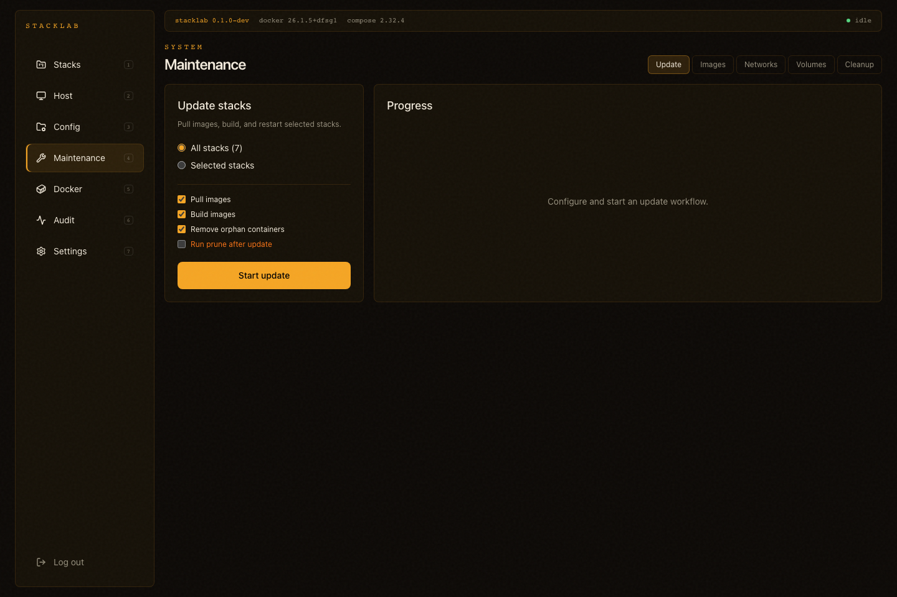
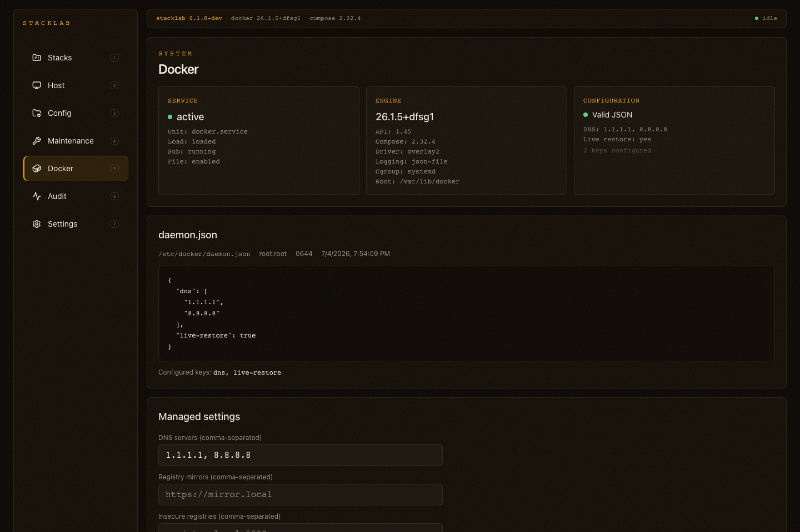

# Stacklab

Stacklab is a host-native, Compose-first control panel for Docker Compose stacks on a single Linux host.

It is built for a homelab-style environment:

- one managed host
- Linux `amd64` as the primary target platform
- Linux `arm64` also supported
- LAN-only usage
- Docker Compose as the source of truth
- filesystem-first management instead of a database-owned stack model

## Status

Stacklab is an active pre-stable release candidate for the single-host v1 scope.

Implemented today:

- authentication and session handling
- stack discovery from the filesystem and Docker runtime
- stack list, stack detail views, and stack-local auxiliary file editing
- Compose definition editor with resolved-config preview
- stack lifecycle actions and job progress
- live logs, stats, and container terminal
- stack create/delete flows
- host overview and Stacklab service log viewer
- config workspace browsing and editing
- Git status, diff, per-file commit, and push for managed workspace files
- workspace permission diagnostics and helper-backed repair
- maintenance inventory, cleanup, and bulk update workflows
- Docker daemon config validation and apply workflow
- notifications, maintenance schedules, and APT-backed self-update
- audit history, retained job detail, and global activity indicator
- backend and frontend automated tests
- manual-on-demand Linux `amd64` and `arm64` release artifact build
- `.deb` build and published APT channels
- staging deployment trials on Linux `arm64`, Ubuntu `amd64`, and Debian `amd64`

Current focus:

- release hardening and stable sign-off
- template library and starter catalog
- background UX polish for long-running operations

## Architecture

Recommended production shape:

- backend: Go
- frontend: React + Vite + TypeScript
- runtime: host-native service, not a Docker management container
- state: filesystem + SQLite operational metadata

Supported install modes:

- Primary: Debian-family hosts via `.deb` and the published APT repository
- Secondary: generic Linux hosts via manual release tarball install
- Unsupported: migration between tarball and package-managed installs

Canonical host layout for package-managed installs:

- `/usr/lib/stacklab`
- `/etc/stacklab/stacklab.env`
- `/srv/stacklab`
- `/var/lib/stacklab`

Canonical host layout for tarball installs:

- `/opt/stacklab/app`
- `/opt/stacklab/stacks`
- `/opt/stacklab/config`
- `/opt/stacklab/data`
- `/var/lib/stacklab`

## Quick Start

### Prerequisites

- Go
- Node.js + npm
- Docker Engine
- Compose v2 available as either `docker compose` or standalone `docker-compose`

### Local development

Backend:

```bash
STACKLAB_BOOTSTRAP_PASSWORD=change-me go run ./cmd/stacklab
```

Frontend dev server:

```bash
cd frontend
npm ci
npm run dev
```

Default local paths are under `.local/stacklab` and `.local/var/lib/stacklab`.

### Built frontend mode

If you want the Go backend to serve the production frontend bundle:

```bash
cd frontend
npm ci
npm run build

cd ..
STACKLAB_BOOTSTRAP_PASSWORD=change-me go run ./cmd/stacklab
```

Then open:

- `http://127.0.0.1:8080`

### Install from APT

Debian-family hosts should install Stacklab from the published APT repository.

Install the repository key:

```bash
sudo mkdir -p /usr/share/keyrings
curl -fsSL https://krbob.github.io/stacklab/apt/stacklab-archive-keyring.gpg \
  | sudo tee /usr/share/keyrings/stacklab-archive-keyring.gpg >/dev/null
```

Add the stable channel:

```bash
arch="$(dpkg --print-architecture)"
echo "deb [arch=${arch} signed-by=/usr/share/keyrings/stacklab-archive-keyring.gpg] https://krbob.github.io/stacklab/apt stable main" \
  | sudo tee /etc/apt/sources.list.d/stacklab.list
```

Install:

```bash
sudo apt-get update
sudo apt-get install stacklab
```

For the nightly channel and additional notes, see:

- [`docs/ops/install-from-apt.md`](docs/ops/install-from-apt.md)

### Install from tarball

For other Linux distributions, Stacklab also ships release tarballs with a
manual host-native install and upgrade flow.

See:

- [`docs/ops/install-from-tarball.md`](docs/ops/install-from-tarball.md)

## Tests

Backend:

```bash
go test ./...
```

Frontend:

```bash
cd frontend
npm test
npm run typecheck
npm run lint
npm run build
```

## Screenshots

| Stacks | Stack Editor |
| - | - |
|  |  |
| Host | Config Workspace |
|  |  |
| Maintenance | Docker Admin |
|  |  |

Refresh the README screenshots against a running Stacklab instance:

```bash
cd frontend
STACKLAB_URL=http://127.0.0.1:18080 \
STACKLAB_PASSWORD=change-me \
npm run screenshots:readme
```

## Documentation

Project documentation lives in [`docs/`](docs/README.md).

Good entry points:

- [`docs/roadmap.md`](docs/roadmap.md)
- [`docs/product/scope.md`](docs/product/scope.md)
- [`docs/product/mvp.md`](docs/product/mvp.md)
- [`docs/product/feature-strategy.md`](docs/product/feature-strategy.md)
- [`docs/architecture/system-overview.md`](docs/architecture/system-overview.md)
- [`docs/ops/systemd.md`](docs/ops/systemd.md)
- [`docs/ops/release-plan.md`](docs/ops/release-plan.md)
- [`docs/ops/debian-package-plan.md`](docs/ops/debian-package-plan.md)
- [`docs/ops/install-from-apt.md`](docs/ops/install-from-apt.md)
- [`docs/ops/install-from-tarball.md`](docs/ops/install-from-tarball.md)

## Current Constraints

- primary production target is Linux `amd64`, with Linux `arm64` also supported
- Stacklab currently assumes a single local operator model
- host shell is intentionally deferred beyond the current MVP
- helper-backed Docker admin, workspace repair, and self-update remain opt-in Linux flows
